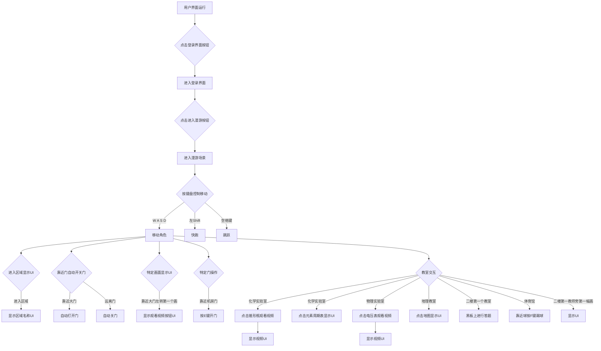
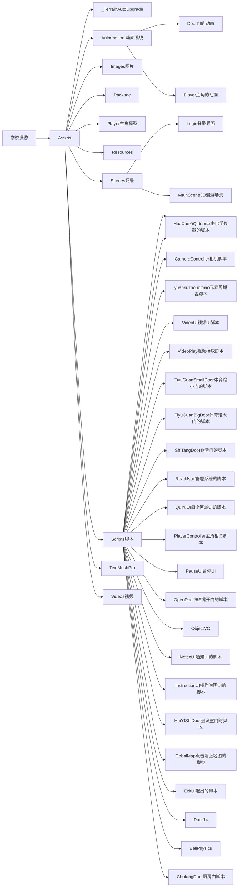

# 小组成员

0210488朱嘉欣:制作了3D漫游场景和相关用户界面，UI登录界面，及其全部相关功能的实现。

0210476刘勋玮:项目文档的编写和创建仓库与上传项目到仓库。

0210492张泽昊：完成热更新部分的功能实现和代码编写。

0210208张新伟：收集资料，项目测试，运行录屏。

# 一、项目运行流程图

# 二、项目工程文件结构图

# 三、项目说明

## 1、用户界面

用户界面有登录界面，下载场景，角色选择三个按钮，点击登录界面按钮会跳转到登录界面。

## 2、登录界面

该界面有 ：

* 进入漫游

* 操作说明

* 退出

* 三个按钮.

  点击进入漫游，可以进入漫游场景。

  点击操作说明按钮可以查看操作说明。

## 3、漫游场景

1. 通过按键盘的W A S D来控制角色的移动。
2. 通过左Shift键来快跑，空格键来跳跃。
3. 角色在进去区域后，会显示区域名称的UI。
4. 角色在靠近门，门时会自动打开，远离时会关门。
5. 角色靠近大门左转第一个画时，会出现一个UI点击按钮可以观看视频。
6. 靠近机房的门时要按E键才能开门。
7. 进入化学实验室后，点击架子上的锥形瓶，会弹出UI，然后点击按钮可以观看视频，点击墙上的元素周期表可以看到元素周期表的UI。
8. 进入物理实验室后，点击桌子上的电压表，会弹出UI，然后点击按钮可以观看视频。
9. 进入地理教室后，点击黑板上的地图，会弹出地图的UI。
10. 进入体育馆，靠近地面上的球，会提示按F键，实现把球踢出的效果。
11. 二楼第一个教室的走廊上的第一画，点击后，会弹出一个UI，进入该教室后，黑板上，有一个答题的UI，点击按钮，可以进行知识答题。

## 4、所用技术

1. 实现靠近门开门，远离关门，使用的是碰撞检测。

2. 点击物品弹出UI，使用的是射线检测。

3. 点击UI按钮实现相关功能，使用的是Button的Onlck事件。

4. 实现靠近区域显示名称，使用的是碰撞检测和UI组件。

5. 实现人物移动，快跑，跳跃，使用的是Rigidbody和Capsule Collide组件，加上编写PlayerController脚本。

6. 所有动画的实现，用到是动画状态机。

7. 答题系统的实现，使用UI和json文本加上脚本实现。

8. 视频播放实现，使用了VideoPlayer组件。

   

# 四、关键代码截图

##  1、移动，跳跃，快跑，踢球

## 2、镜头视角控制

## 3、教学楼大门

## 4、按键开门

## 5、区域名称

## 6、暂停UI界面

## 7、视频播放与暂停，停止

## 8、点击物品弹出UI

## 9、感应门

## 10、答题系统

## 11、资源管理进阶

## 12、Scrpitobject使用

## 13、增量更新

## 14、资源远端下载

## 15、资源断点续传

